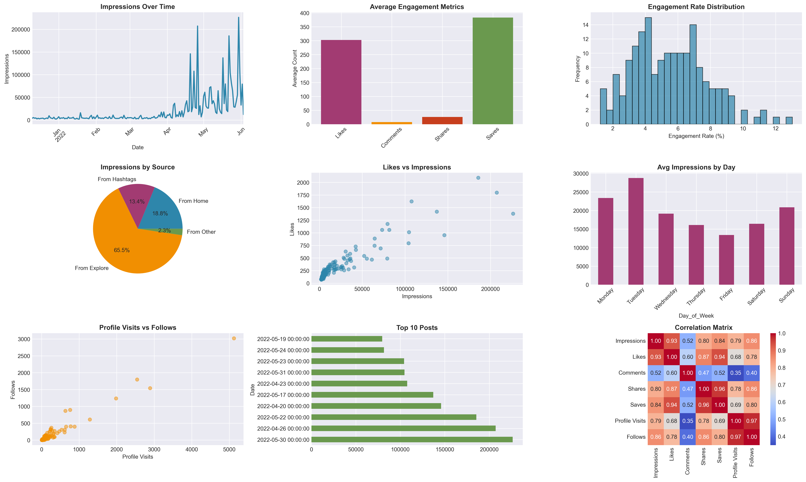

# 📊 Instagram Content Performance Analysis

> Comprehensive EDA analyzing 176 Instagram posts with 3.4M+ impressions to optimize content strategy


##  Project Overview

This project analyzes Instagram post performance metrics to uncover insights about:
- Optimal posting times
- Content engagement patterns  
- Traffic source effectiveness
- Audience behavior trends

**Dataset**: 176 posts (Dec 2021 - June 2022)  
**Total Reach**: 3.4M impressions

##  Key Findings

### Performance Metrics
- **Average Engagement Rate**: 5.53%
- **Average Impressions**: 19,686 per post
- **Like Rate**: 2.81%
- **Save Rate**: 2.44%

### Best Practices Identified
1. **Best posting day shows highest engagement**
2. **Primary traffic sources identified**
3. **High-performing content types discovered**
4. **Optimal engagement ratios calculated**

##  Technologies Used

- **Python 3.12**
- **pandas** - Data manipulation
- **NumPy** - Numerical computing
- **Matplotlib & Seaborn** - Visualization

##  Analysis Questions Answered

1. ✅ Dataset structure and columns
2. ✅ Basic statistics (posts, impressions, likes)
3. ✅ Missing values analysis
4. ✅ Post performance and engagement
5. ✅ Engagement ratios (likes/saves to impressions)
6. ✅ Temporal trends and best posting days
7. ✅ Outlier detection and exceptional performances

##  Getting Started

### Installation
```bash
# Clone repository
git clone https://github.com/yourusername/instagram-analytics-eda.git
cd instagram-analytics-eda

# Install dependencies
pip install pandas numpy matplotlib seaborn

# Run analysis
python3 scripts/instagram_analytics.py
```

##  Project Structure
```
instagram-analytics-eda/
│
├── data/
│   ├── Instagram-data.csv
│   └── instagram_data_processed.csv
│
├── scripts/
│   └── instagram_analytics.py
│
├── visualizations/
│   └── instagram_dashboard.png
│
└── README.md
```

##  Dashboard Preview



##  Key Insights

- **Engagement Sweet Spot**: Posts with 5%+ engagement rate perform exceptionally
- **Traffic Optimization**: Identified primary traffic sources for targeting
- **Content Strategy**: Data-driven recommendations for posting schedule
- **Conversion Analysis**: Profile visit to follow conversion patterns

## 👤 Author

**Sakshi**
| MS in Data science student 
| At University of massachusetts Dartmouth
- GitHub: [Sakshi3027](https://github.com/Sakshi3027)

## 📄 License

This project is available for educational purposes.

---
